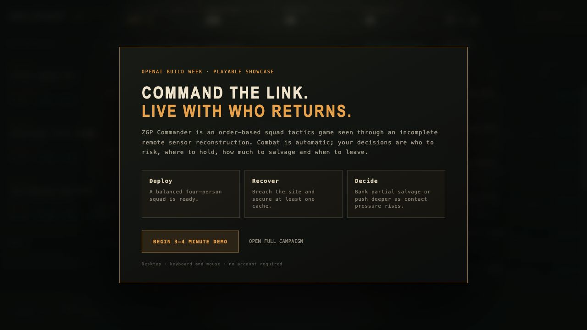
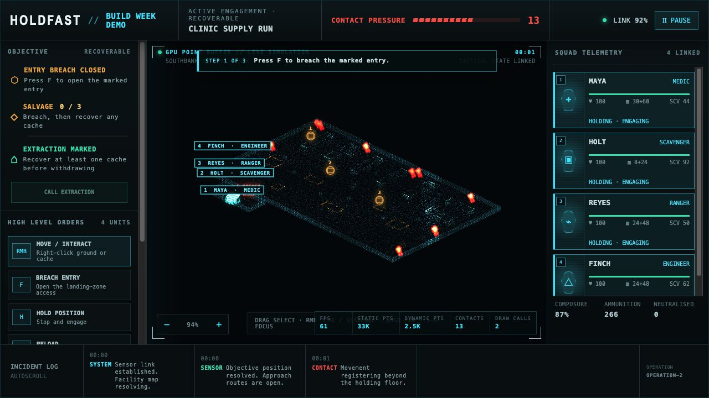
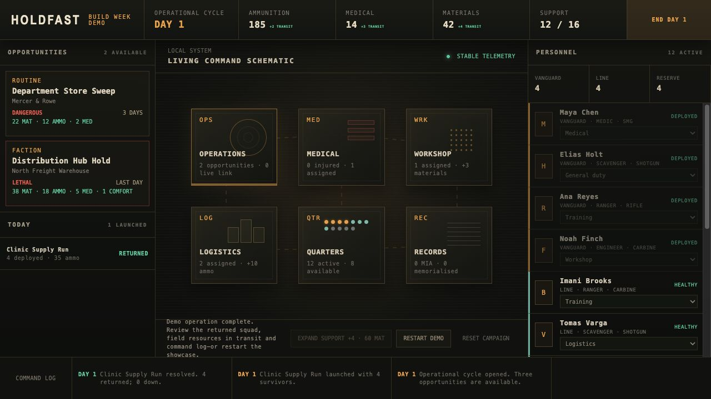

# ZGP Commander

**Command persistent survivors through an incomplete remote sensor feed—take
what you can, decide when to leave, and live with who returns.**

[Play the 3–4 minute Build Week demo](https://betterlucky.github.io/ZGP-Commander/?demo=1)
· [Open the full campaign](https://betterlucky.github.io/ZGP-Commander/)
· [Watch the 2:52 demo](https://youtu.be/0hmdHQcRuaY)
· [View the submission](https://devpost.com/software/zgp-commander)
· [Build Week evidence](BUILD_WEEK.md)

[](https://github.com/betterlucky/ZGP-Commander/actions/workflows/ci.yml)
[](https://github.com/betterlucky/ZGP-Commander/actions/workflows/pages.yml)



ZGP Commander is an order-based squad tactics and campaign game. You prepare a
persistent survivor roster at a living outpost, deploy through the reconstructed
Ghostlink feed, and issue high-level orders while combat resolves automatically.
The important decisions are who to risk, where to hold, how much to recover and
when to leave.

The repository contains a playable campaign vertical slice built with Codex and
GPT-5.6 for [OpenAI Build Week 2026](https://openai.com/build-week/).

## Built with Codex and GPT-5.6

This project was built through rapid implementation by Codex followed by direct
human playtesting, rejection and redirection. Codex accelerated the work by
turning product constraints into the TypeScript/Vite application, deterministic
campaign and tactical simulation, WebGL2 point-cloud renderer, Canvas fallback,
automated tests, GitHub Pages deployment and browser-driven verification. It also
implemented and compared several working visual approaches before synthesising
the final Ghostlink point-sensor presentation.

The human contribution was product and design authority: choosing a fresh browser
build, defining persistent survivors and automatic combat, rejecting the earlier
thermal and conventional graphical directions, selecting the incomplete remote
sensor concept, setting the scope cut, tuning the risk and pacing through repeated
playthroughs, and accepting or revising every player-facing decision. GPT-5.6 in
Codex supplied implementation speed and technical iteration; the final game shape,
trade-offs and acceptance decisions remained human-directed. The detailed,
timestamped collaboration record is in [Build Week evidence](BUILD_WEEK.md).

## Judge quick start

The hosted demo needs a desktop browser, keyboard and mouse. It uses a separate,
fresh save on every page load and cannot overwrite an ordinary campaign.

1. Open the [guided demo](https://betterlucky.github.io/ZGP-Commander/?demo=1).
2. Choose **Begin 3–4 minute demo**, step through the four squad introductions,
   then choose **Establish Link**.
3. Complete the Ghostlink sensor check before opening the breach: zoom fully in
   to inspect the reconstructed points, then fully out to return to command scale.
4. Press `F` to breach. Right-click a numbered cache to assign the best
   scavenger while the other survivors cover them.
5. Secure at least one cache, return every standing survivor to the clearly
   marked extraction zone, and call extraction—or push deeper first.
6. Review the returned squad, resources in transit and command log at base.

No account, download or prior save is required. **Restart demo** gives the
showcase a clean state at any time.



## What is in the slice

- Persistent 12-person roster with tiers, roles, equipment and base jobs.
- Rotating mission board with explicit risk, rewards and expiry.
- Rolling squad deployment with ammunition and opportunity costs rather than a
  fixed mission or squad cap.
- WebGL2 Ghostlink mission view with one readable operation floor, roughly
  33,000 environment points, live contacts and two point-cloud draw calls. A
  Canvas fallback is available when WebGL2 is unavailable.
- Automatic combat, eight-direction routed movement, stationary reloads,
  multi-cache salvage, exterior breach and partial or full extraction.
- Mission resolution, injuries, MIA/death states, rescue offers and delayed
  field rewards.
- End-of-day base production, recovery and expandable support capacity.
- Versioned local browser save. `RESET CAMPAIGN` starts over.
- An isolated deterministic Build Week route at `?demo=1`; the 100-contact
  rendering stress fixture remains available at `?benchmark=1`.

No image assets or runtime generative systems are required by the game. The UI,
point-cloud environment and tactical effects are rendered from code.



## Run locally

Requires Node.js 22 or newer and a current desktop browser. Chrome/Chromium,
Edge, Firefox and Safari are the intended targets; WebGL2 gives the full
presentation and Canvas provides a compatible tactical fallback.

```bash
npm ci
npm run dev
```

Use the local URL printed by Vite. Add `?demo=1` for the guided showcase.
Add `?demo=1&canvas=1` to exercise the Canvas fallback explicitly.

```bash
npm run check
```

`check` runs 29 campaign/simulation tests, strict TypeScript validation and the
production Vite build used by continuous integration.

## Tactical controls

| Input | Command |
| --- | --- |
| Left-drag on the tactical map | Box-select survivors |
| `Shift` + left-drag | Add survivors to the current selection |
| Click a survivor card | Select that survivor |
| `Shift` + click a survivor card | Add or remove that survivor from the selection |
| Double-click a survivor card | Select and smoothly centre the camera on that survivor |
| Number keys `1`–`9` | Select and centre the camera on the corresponding survivor |
| `Ctrl/Cmd+A` or **Select Squad** | Select every survivor; plain `A` pans the camera left |
| Right-click open ground | Move selected survivors in formation |
| Right-click a numbered cache | Assign the best selected scavenger while the others cover |
| Right-click the marked extraction zone | Return selected survivors to the landing area |
| `F` or **Breach Entry** | Open the marked entrance when a selected survivor is close enough |
| `H` or **Hold Position** | Stop selected standing survivors and engage from their position |
| `R` or **Reload** | Reload selected standing survivors in place |
| `Space` or the pause button | Pause or resume; Space is reserved until the demo sensor check finishes |
| `W` / `A` / `S` / `D` | Smoothly pan the camera up / left / down / right |
| Arrow keys | Pan the camera in the corresponding direction |
| Middle-button drag | Freely pan the camera |
| Mouse wheel, `+` / `-`, or zoom buttons | Zoom around the pointer or viewport centre |
| **Call Extraction** | End the mission once at least one cache is secured and every standing survivor is inside extraction |

## Architecture

Campaign state creates mission definitions and deployments. The tactical
simulation accepts explicit commands and emits events/results plus plain
presentation snapshots. Ghostlink renderers consume those snapshots; they do
not own gameplay rules. Campaign resolution then applies persistent personnel
and resource consequences.

This separation keeps campaign rules testable, prevents renderer state from
becoming authoritative and leaves room for deterministic scenario fixtures.
See [Architecture](docs/ARCHITECTURE.md) for the boundaries and data model.

Project documentation:

- [Build Week evidence](BUILD_WEEK.md) — eligible timeline, Codex/GPT-5.6
  collaboration, verification and limitations.
- [Game foundations](docs/GAME_FOUNDATIONS.md) — authoritative product and
  presentation decisions.
- [Architecture](docs/ARCHITECTURE.md) — runtime boundaries and data model.
- [Migration policy](docs/MIGRATION.md) — how older ZGP projects are used as
  behavioural references without inheriting their runtime architecture.
- [Open questions](docs/OPEN_QUESTIONS.md) — tuning and content questions that
  should be answered through prototypes and playtesting.

## Licence

The source code is available under the [MIT License](LICENSE). The licence does
not grant rights to the ZGP Commander name or branding.

The runner-rush alarm uses [Red Alert Klaxon Re-Creation](https://pixabay.com/sound-effects/red-alert-klaxon-re-creation-107222/)
by wrstone (Freesound), distributed through Pixabay under the Pixabay Content
License. The included version has a short fade applied for the game.
